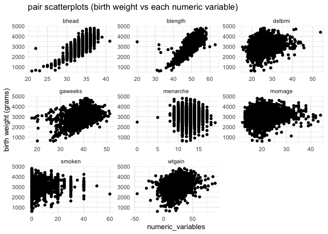
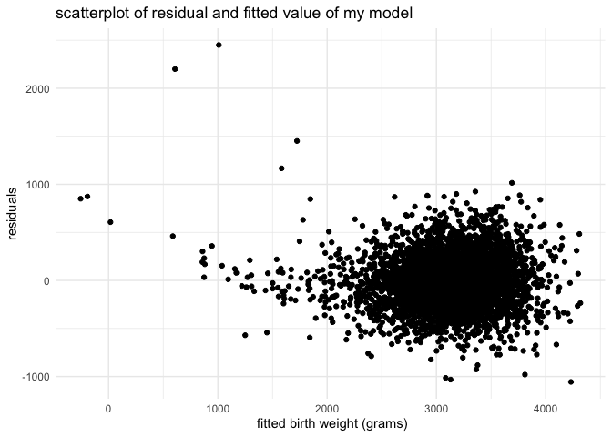

p8105\_hw6\_ry2417
================
Ruiqi Yan
11/26/2021

## Problem 1

import data and check for missing value

``` r
children_df <- read_csv("data/birthweight.csv")
children_df %>% 
  skimr::skim() %>% 
  select(skim_variable, n_missing) %>% 
  knitr::kable()
```

| skim\_variable | n\_missing |
|:---------------|-----------:|
| babysex        |          0 |
| bhead          |          0 |
| blength        |          0 |
| bwt            |          0 |
| delwt          |          0 |
| fincome        |          0 |
| frace          |          0 |
| gaweeks        |          0 |
| malform        |          0 |
| menarche       |          0 |
| mheight        |          0 |
| momage         |          0 |
| mrace          |          0 |
| parity         |          0 |
| pnumlbw        |          0 |
| pnumsga        |          0 |
| ppbmi          |          0 |
| ppwt           |          0 |
| smoken         |          0 |
| wtgain         |          0 |

According to the table above, there is no missing value in any variable.
Let’s convert the `babysex`, `frace`, `malform` and `mrace` to factor
variables.

``` r
children_df <- 
  children_df %>% 
  mutate(
    babysex = fct_recode(factor(babysex), male = "1", female = "2"),
    frace = fct_recode(factor(frace),
      White = "1", 
      Black = "2", 
      Asian = "3", 
      Puerto_Rican = "4", 
      Other = "8",
      Unknown = "9"
    ),
    malform = fct_recode(factor(malform), absent = "0", present = "1"),
    mrace = fct_recode(factor(mrace),
      White = "1", 
      Black = "2", 
      Asian = "3", 
      Puerto_Rican = "4", 
      Other = "8"
    )
  )
```

From my prospective and guess, children birth weight should have
associations with baby’s sex `babysex`, baby’s head circumference at
birth `bhead`, baby’s length at birth `blength`, mother’s age at
menarche `menarche`, gestational age in weeks `gaweeks`, presence of
malformations `malform`, mother’s race `mrace`, mother’s age at delivery
`momage`, mother’s weight gain during pregnancy `wtgain`, average number
of cigarettes smoked per day during pregnancy `smoken`and mother’s BMI
at delivery, which is the ratio of mother’s weight at delivery `delwt`
to square of mother’s height `mheight`. First of all, I use the scatter
plots between birth weight and each numeric variable to check if the
association is linear.

``` r
children_df <- 
  children_df %>% 
  mutate(
    delbmi = 703*delwt/mheight^2
  ) 
children_df %>% 
  select(bwt, bhead, blength, menarche, gaweeks, momage, wtgain, smoken, delbmi) %>% 
  pivot_longer(cols = -bwt, 
         names_to = "var", values_to = "factor_values") %>% 
  ggplot(aes(y = bwt, x = factor_values)) +
  geom_point() +
  facet_wrap(.~var, scales = "free") +
  labs(y = "birth weight (grams)",
      title = "Pair Scatter Plots (birth weight vs numeric factors")
```

<!-- -->

Based on these pair scatter plots, we have some ideas about their
associations. The association between birth weight and mother’s BMI at
delivery `delbmi` is piece wise linear with change point at about 28.
The association between birth weight and mother’s age at delivery
`momage` is also is piece wise linear with change point at about 25.
There are no apparent patterns of birth weight with mother’s age at
menarche `menarche` and average number of cigarettes smoked per day
during pregnancy `smoken`. The rest of the plots look linear. Thus, I
will remove `smoken` and `menarche` from my model and use piece-wise
transformation for `momage` and `delbmi`.  

``` r
children_df <- 
  children_df %>% 
  mutate(
    delbmi_cp = (delbmi > 28) * (delbmi - 28),
    momage_cp = (momage > 25) * (momage - 25)
  )
```

For the categorical data, I use look over the distributions of birth
weight among different levels of each categorical variable of interest
to check if it is necessary to include the variable.

``` r
children_df %>% 
  select(bwt, malform, babysex, mrace) %>% 
  pivot_longer(cols = -bwt, 
         names_to = "var", values_to = "factor_levels") %>% 
  ggplot(aes(y = bwt, x = factor_levels, factor_levels)) +
  geom_violin(alpha = .3) +
  facet_wrap(.~var, scales = "free") +
  labs(y = "birth weight (grams)",
      title = "distribution of birth weight among different levels of categorical varaibles")
```

<!-- -->

Based on these box plots, there is no significant difference of birth
weight between malformation present and absent, so I would remove
`malform` from the model.  

Then, my model is
`lm(bwt ~ bhead + blength + gaweeks + wtgain + momage + momage_cp + delbmi + delbmi_cp + babysex + mrace, data = children_df)`

``` r
my_model <- lm(bwt ~ bhead + blength + gaweeks + wtgain + momage + momage_cp + delbmi + delbmi_cp + babysex + mrace, data = children_df)
```

show a plot of model residuals against fitted values

``` r
children_df %>% 
  add_predictions(my_model) %>% 
  add_residuals(my_model) %>% 
  ggplot(aes(x = pred, y = resid)) +
  geom_point()
```

<!-- -->

Compare with two other models:

One using length at birth and gestational age as predictors

``` r
model_2 <- lm(bwt ~ blength + gaweeks, data = children_df)
```

One using head circumference, length, sex, and all interactions
(including the three-way interaction) between these

``` r
model_3 <- lm(bwt ~ bhead*blength*babysex, data = children_df)
```

Make the comparisons in terms of the cross-validated prediction error;

``` r
cv_df <- crossv_mc(children_df, 500, test = .2) %>% 
  mutate(
    test = map(test, as_tibble)
  )
cv_df <- 
  cv_df %>%
  mutate(
    my_model = map(.x = train, 
                   ~ lm(bwt ~ bhead + blength + gaweeks + wtgain + momage + momage_cp + delbmi + delbmi_cp + babysex + mrace,
                        data = .x)),
    model_2 = map(.x = train, ~ lm(bwt ~ blength + gaweeks, data = .x)),
    model_3 = map(.x = train, ~ lm(bwt ~ bhead*blength*babysex, data = .x))
  ) %>%
  mutate(
    rmse_my_model = map2_dbl(.x = my_model, .y = test, ~ rmse(model = .x, data = .y)),
    rmse_model_2 = map2_dbl(.x = model_2, .y = test, ~ rmse(model = .x, data = .y)),
    rmse_model_3 = map2_dbl(.x = model_3, .y = test, ~ rmse(model = .x, data = .y))
  )

cv_df %>% 
  pivot_longer(cols = starts_with("rmse"),
               names_to = "model_type",
               values_to = "rmse",
               names_prefix = "rmse_") %>% 
  mutate(model = fct_inorder(model_type)) %>%
  ggplot(aes(x = model_type, y = rmse, fill = model_type)) +
  geom_violin(alpha = .3)
```

<!-- -->
